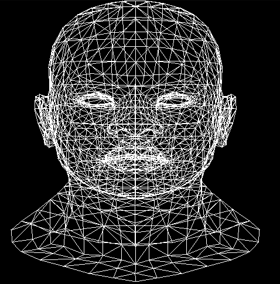
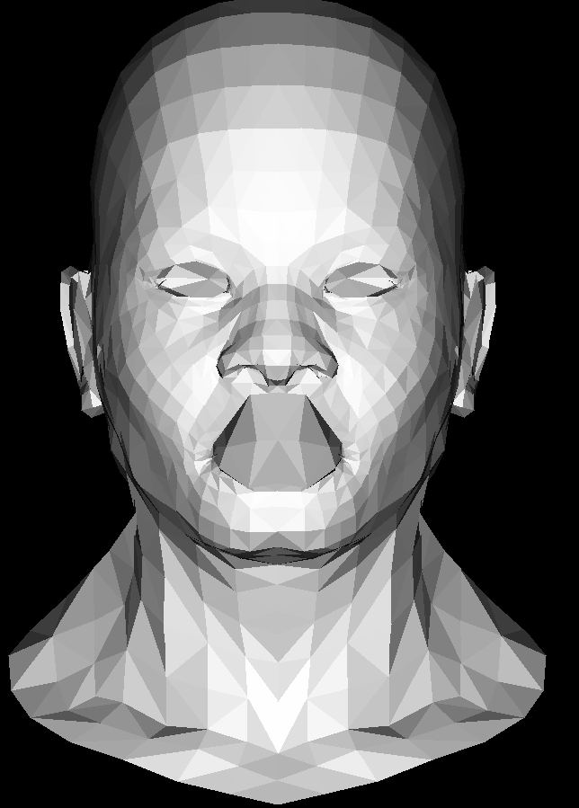
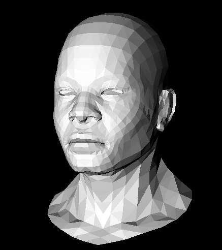

# renderer

This is a renderer for the .obj file format of 3D models often used in 
applications like blender. SDL has been used for the creation of windows and 
drawing points on said window, however all other operations were written by me.

## Using the program:

To run the program simply run `main` with an optional argument of a supplied 
.obj file to render.

## Building :hammer::construction_worker:

As this program requires the use of SDL users must install the required packages
in order to build. For instructions on installing the dependencies look at the 
[SDL wiki](https://wiki.libsdl.org/SDL2/Installation).

## Progression :chart_with_upwards_trend: 
I've taken an incremental approach to the project intially starting with a very
basic renderer and slowly adding additional features. Here's the progress that
I've made:

1. This was the start of the project. I completely ignored z values and just
scaled the x and y coordinates to appropriate values for my screen. it was fast
but could only draw wireframes of the models and points were rendered
just using x and y coordinates (z wasn't used anywhere).

2. Triangle fill! We can finally draw faces for models not needing to use 
wireframes. Along with this we can add some shading by calculating the
dot-product of the normal of faces and a "light-vector". Still had some missing
features: can't move the model around, and we are still "cheating" by just
scaling the x and y of points and disregarding the z values.

3. Cleaning things up. Hidden face culling was implemented using a z-buffer
and the depth of points along a face (plane) are interpolated. Additionally,
we finally started implementing some linear algebra functionality to properly
transform points! This adde perspective rendering and the ability to rotate
the models by adjusting yaw and pitch parameters of the rendering environment.

## TODO :white_check_mark:
- Currently working on the 4th iteration of the renderer which will include
  phong shading giving models (ideally) a more smooth look than the current 
  jagged edges.
    - implement extra linear algebra tooling for calculating the transformation
      matrix of normal vectors. :white_check_mark:
    - implement a method of interpolating values of normal for points along
      face. :black_square_button: 
